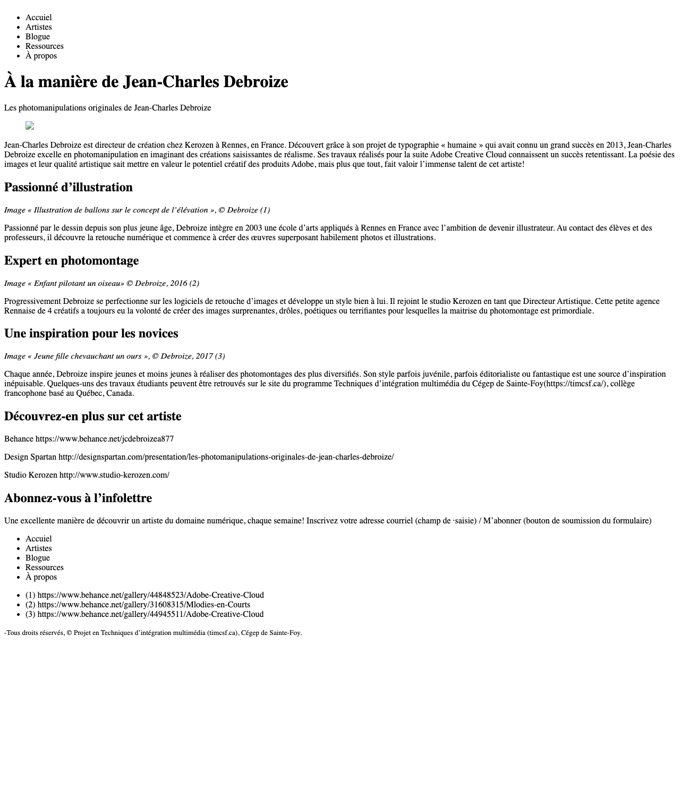

# TP1 À la manière de - Solution 
 

## Table des matières

- [TP1 À la manière de - Solution](#tp1-à-la-manière-de---solution)
  - [Table des matières](#table-des-matières)
  - [Aperçu](#aperçu)
    - [Capture d'écran](#capture-décran)
    - [Lien](#lien)
  - [Mon processus](#mon-processus)
    - [Outils utilisés](#outils-utilisés)
    - [Ce que j'ai appris](#ce-que-jai-appris)
    - [Améliorations futures](#améliorations-futures)
    - [Ressources utiles](#ressources-utiles)
  - [Auteur](#auteur)
  - [Remerciements](#remerciements)
 

## Aperçu

### Capture d'écran



Ajoutez une capture d'écran de votre solution.   

### Lien

- URL du site en ligne : [Ajoutez ici l'URL du site](https://your-live-site-url.com)

## Mon processus

### Outils utilisés

- HTML5 sémantique
- CSS
- Flexbox 
- Approches mobile-first et en amélioration progressive 

### Ce que j'ai appris

j'ai eu un rappel sur comment faire du html sémantique
Exemples :

```html
<h1>Un code HTML dont je suis fier</h1>
```
```css
.proud-of-this-css {
  color: papayawhip;
}
``` 

### Améliorations futures

CSS et flexbox

### Ressources utiles

- [Exemple de ressource](https://developer.mozilla.org/en-US/docs/Web/HTML) - Cette ressource m'a aidé pour le html. Je recommande ce lien à ceux qui apprennent encore ce concept.

## Auteur

- Page profil Github - [Jude Ndjila](https://github.com/VOTRE_NOM) 

## Remerciements

Remerciez ici les personnes qui vous ont aidé sur ce projet. Si vous l'avez réalisé seul, vous pouvez supprimer cette section.
